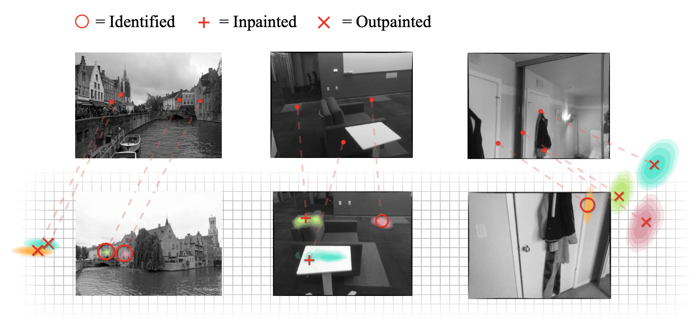

# Visual Correspondence Hallucination: Towards Geometric Reasoning 

This is the official repository for our paper [Visual Correspondence Hallucination: Towards Geometric Reasoning ](http://arxiv.org/abs/2106.09711).
Source code will be made available shortly.

<p align="center">
  <a href="http://arxiv.org/abs/2106.09711"></a>
</p>

## Abstract

Given a pair of partially overlapping source and target images and a keypoint in the source image, the keypoint’s correspondent in the target image can be either visible, occluded or outside the field of view. Local feature matching methods are only able to identify the correspondent’s location when it is visible, while humans can also hallucinate its location when it is occluded or outside the field of view through geometric reasoning. In this paper, we bridge this gap by training a network to output a peaked probability distribution over the correspondent’s location, regardless of this correspondent being visible, occluded, or outside the field of view. We experimentally demonstrate that this network is indeed able to hallucinate correspondences on unseen pairs of images. We also apply this network to a camera pose estimation problem and find it is significantly more robust than state-of-the-art local feature matching-based competitors.

## BibTex

Please consider citing our work:

```
@inproceedings{germain2021NeurHal,
  author    = {Hugo Germain and
               Vincent Lepetit and
               Guillaume Bourmaud},
  title     = {Visual Correspondence Hallucination: Towards Geometric Reasoning},
  booktitle = {ArXiv Preprint},
  year      = {2021},
  url       = {http://arxiv.org/abs/2106.09711}
}
```


